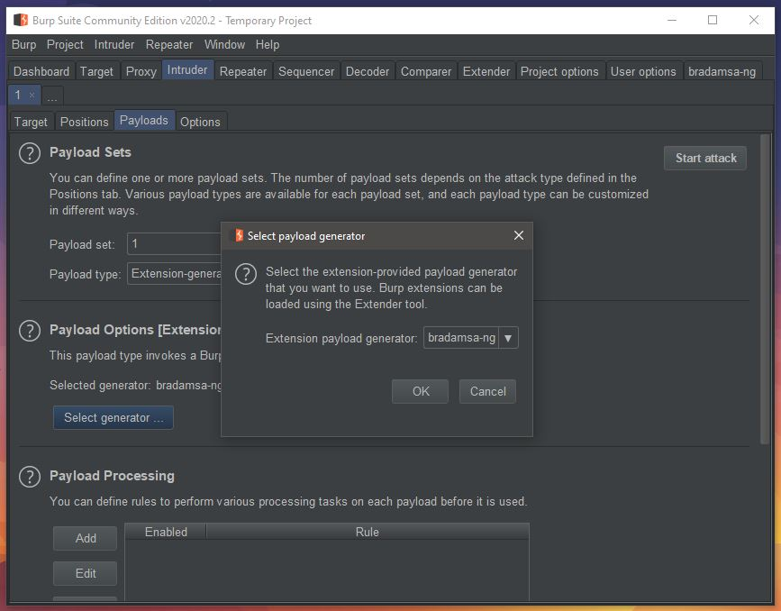
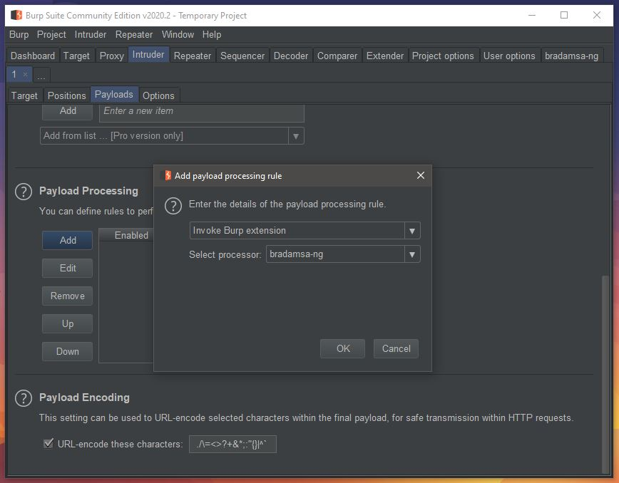
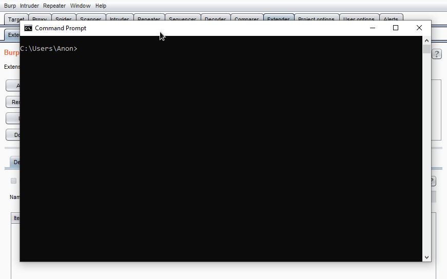

# bradamsa-ng

[](https://travis-ci.com/nscuro/bradamsa-ng)
[](https://snyk.io/test/github/nscuro/bradamsa-ng?targetFile=pom.xml)
[](https://codecov.io/gh/nscuro/bradamsa-ng)

*A Burp Suite extension for Radamsa-powered fuzzing with Intruder*

## Index

- [Introduction](#introduction)
- [Requirements](#requirements)
- [Installation](#installation)
- [Building](#building)
- [Usage](#usage)
  - [Intruder Payload Generator](#intruder-payload-generator)
  - [Intruder Payload Processor](#intruder-payload-processor)
  - [WSL mode](#wsl-mode)
- [FAQ](#faq)
  
## Introduction

*bradamsa-ng* is a [Burp Suite](https://portswigger.net/burp/) extension that brings the power of the amazing 
[Radamsa](https://gitlab.com/akihe/radamsa) fuzzer to Intruder. It is influenced by the original 
[*bradamsa* by *ikkisoft*](https://github.com/ikkisoft/bradamsa).

One noteworthy feature of *bradamsa-ng* is its support for [WSL](https://docs.microsoft.com/en-us/windows/wsl/about).  
Radamsa is (understandably) not developed with Windows in mind, which means that there is no official support for it. 
There was a solution to [build Radamsa using Cygwin](https://github.com/aoh/radamsa/issues/31#issuecomment-266049451), 
but it didn't reliably work for me, and there's simply no guarantee that it'll work forever.  
  
With WSL however, we can compile and run Radamsa in its natural habitat - hell, we can even run it from the Windows host:

```shell script
PS> wsl -d Ubuntu -e which radamsa
/usr/bin/radamsa
PS> echo "fuzzing with radamsa is fun!" | wsl -d Ubuntu -e radamsa
fuzzzing with rrrrrradamsa is funn!
```

With *bradamsa-ng*, these new possibilities can now be leveraged in Burp.

## Requirements

* Java >= 11
  * Why? Well...
    * [Burp >= 2.0.14 ships with OpenJDK 11](https://twitter.com/Burp_Suite/status/1088829534600921090)
    * [Burp >= 2020.4 requires Java >= 8](https://portswigger.net/burp/releases/professional-community-2020-4)
    * [Java versions > 8 and < 11 are out of support](https://adoptopenjdk.net/support.html#roadmap)
* Burp Suite >= 2.1
* Radamsa >= 0.6

## Installation

* [Build](#building) the extension or download a [release](https://github.com/nscuro/bradamsa-ng/releases)
* Open Burp and navigate to the *Extender* tab
* Click *Add*
* In the dialog that just opened, select the extension type *Java*
* Click *Find File* and select your `bradamsa-ng-jar-with-dependencies.jar`
* Click *Next* - that's it

*bradamsa-ng* tries to automatically detect a *Radamsa* binary in your `$PATH`. If this succeeds, you'll
see a message saying 

> WSL is not available
> searching for Radamsa executable
> Radamsa executable found at /usr/bin/radamsa

in the extension's *Output* tab.

Likewise, when running on Windows and WSL is available, you'll either see

> WSL is available, but no distributions are installed

or 

> WSL is available and the following distributions have been found: [Ubuntu]  
> WSL mode enabled with distribution Ubuntu  
> searching for Radamsa executable  
> Radamsa executable found at /usr/bin/radamsa

depending on if WSL distributions are installed or not. As you can see, *bradamsa-ng* will automatically enable
WSL mode for you, using your default WSL distribution.

## Building

* Linux / macOS: `./mvnw clean package`
* Windows: `.\mvnw.cmd clean package`

The installable extension JAR can now be found at `target/bradamsa-ng-${version}-jar-with-dependencies.jar`

## Usage

### Intruder Payload Generator

* In Intruder's *Payloads* tab under *Payload Sets*, select the payload type *Extension-generated*
* Next, choose *bradamsa-ng* as generator under *Payload Options [Extension Generated]*



* In the *bradamsa-ng* tab:
  * Adjust the amount of payloads you want to generate
    * Providing a number <= 0 will be interpreted as "infinite"
  * Optionally provide sample files

Per default, the value of payload positions (those enclosed in `§`) will be fuzzed. If you provide samples, those values 
will be ignored and Radamsa will generate values based on the sample files instead.

For the *Battering Ram* attack type you **must** provide sample files.
See the [relevant FAQ section](#i-get-an-error-saying-no-base-value-or-sample-paths-provided-for-battering-ram-attacks-what-am-i-doing-wrong).

### Intruder Payload Processor

* In Intruder's *Payloads* tab under *Payload processing*, click *Add*
* For *Rule type*, choose *Invoke Burp extension*
* Select *bradamsa-ng* as payload processor



### WSL mode

*bradamsa-ng* supports using Radamsa through Windows 10's *Windows Subsystem for Linux*.  
In order to take advantage of it, you need the following:

* Windows 10 with WSL installed
  * Instructions to install WSL can be found [here](https://docs.microsoft.com/en-us/windows/wsl/install-win10)
* At least one installed WSL distribution (e.g. [Ubuntu](https://www.microsoft.com/en-us/p/ubuntu/9nblggh4msv6))
* [Radamsa](https://gitlab.com/akihe/radamsa) installed in at least one of the distributions
  * The `radamsa` executable must be present in the distribution's `PATH`
  * Using `sudo make install` will make it easier for *bradamsa-ng* to find the Radamsa binary



* The extension will let you know if WSL is available on startup as mentioned in [Installation](#installation)
* Switch to the *bradamsa-ng* tab and tick the *Enable WSL mode* checkbox
* Select the distribution where *Radamsa* is installed in
* *bradamsa-ng* will attempt to automatically find a Radamsa binary in the selected distro's `$PATH`
  * If this fails you can manually enter the **absolute** path to the binary **inside the WSL distro**
  * At this point, *bradamsa-ng* will simply check if the entered value points to an existing file **or** is a command that can be found in the distro's `$PATH`

#### Utilized commands

If, for whatever reason, your AV kicks in when using *bradamsa-ng* in WSL mode, here's a list of commands that *bradamsa-ng* 
will execute in order to make WSL mode possible:

| Command         | Used for                                                    | Example                                              |
| --------------- | ----------------------------------------------------------- | ---------------------------------------------------- |
| `where.exe`     | Checking if WSL installed                                   | `where.exe /q wsl.exe`                               |
| `WMIC.exe`      | Determination of Windows 10 build number                    | `WMIC.exe os get version /format:LIST`               |
| `wslconfig.exe` | Listing of available WSL distros (for Windows 10 < 1903)    | `wslconfig.exe /list`                                |
| `wsl.exe`       | Listing available WSL distros; Execution of commands in WSL | `wsl.exe --list`, `wsl.exe -d <DISTRO> -e <COMMAND>` |

## FAQ

### Why can't I choose a custom seed?

Quoting [Radamsa's README](https://gitlab.com/akihe/radamsa#fuzzing-with-radamsa):

> By default radamsa will grab a random seed from /dev/urandom if it is not given a specific random state to start from, 
> and you will generally see a different result every time it is started, though for small inputs you might see the same 
> or the original fairly often. The random state to use can be given with the -s parameter, which is followed by a number. 
> **Using the same random state will result in the same data being generated**.

*bradamsa-ng*'s payload generator works by invoking Radamsa every time a new payload is requested by Intruder. 
Providing a custom seed would mean that the same payload will be generated over and over again, which would totally 
defeat the purpose of a fuzzer.

### I get an error saying "No base value or sample paths provided" for Battering Ram attacks. What am I doing wrong?

In Intruder, you specify the positions in a request to insert your payloads in. Typically, you'll just wrap the current
parameter's value inside two `§` symbols. When you run the attack, Burp will pass the current value to Payload Generators
and Payload Processors for modification. In this case, *bradamsa-ng* simply pipes the current value into Radamsa and returns
the result. The Battering Ram attack is different in that Burp won't pass any current values to payload generators or processors.
When using this attack mode, you'll have to specify at least one sample file, otherwise there simply isn't anything to fuzz.
